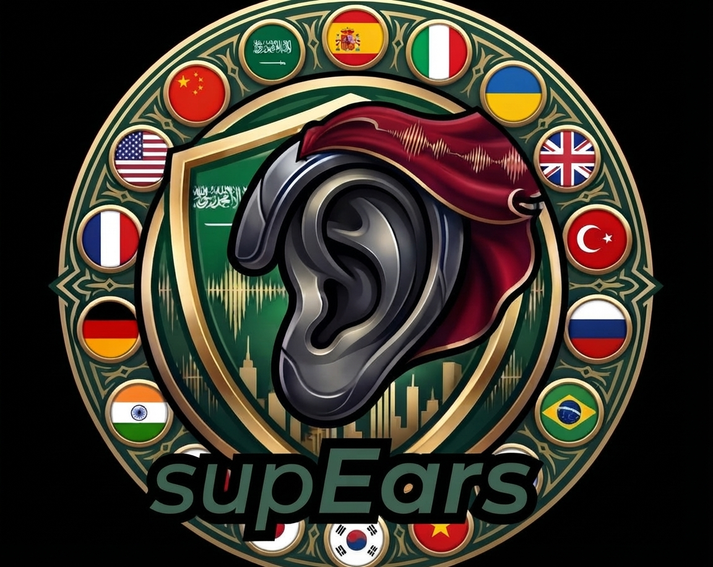

  

**[Click Here to Download supEars Now.](https://github.com/humbleangel/supEars_Official/releases/latest)** 
Speak in your own native language. 
supEars translates and transcribes for you.

  
  
  
  
  
  
  
  
  
  
  
  
  
  
  
  
  
  
  
  
  
  
  
  
  
  
  
  
  
  
  
  
  
  
  
  
  
  
  
  
  
  
  
  
  
  
  
  
  
  
  
  
  
  
  
  
  
  
  
  
  
  
  
  
  
  
  
  
  
  
  
  
  
  
  
  
  
  
  
  

**Beta Available. Official Release: October 10, 2026.**

Escape the Big Tech Corps Subscriptions Traps. 
100% Offline Transcription. No Credit Card. No Account. No Cloud. No money to MegaCorps. 
Windows Ready. Mac and Linux are under development.

[YouTube @supEars](https://www.youtube.com/channel/UCznNnUBltWG8lrSXC39e5lw) · [Reddit u/humbleangel](https://www.reddit.com/user/humbleangel)

- Speak in your language; supEars write in English or in any of the 26 supported languages.
- Runs on any Desktop or Notebook (even without Graphics Card).
- Free forever (14 days unlimited use/limited use per day after it/free weeks kindly gifted by the dev, HumbleAngel).
  50% discount Lifetime License for the first 1000 users. ~US$ 4.99 / 1 month · ~US$ 14.99 / 6 months
- No subscriptions, no auto-renewal, ever.

## Roadmap

- Quality improvements/bug fixes
- Mac/Linux
- Full Interface in all available languages
- Streaming (words appear as you talk)

## Version history

- v0.9.63 (current): Clearer messages while you dictate; a new window shows progress while the app gets ready; faster long recordings; reliability wave.
- v0.9.61: The ESC key stops a recording and cancels work, anytime.
- v0.9.57: Five new language engines (Cantonese, Thai, Serbian, Danish, Norwegian); better Swedish engine.
- v0.9.56: License window rework (clearer status, per-tier buying, PIX QR window).
- v0.9.55: Window handling rebuilt (ghost and blink bugs gone).
- v0.9.54: Start-screen reliability wave of fixes.
- v0.9.53: Update window rebuilt (progress bar, one-click apply, smooth restart).
- v0.9.52: New welcome-screen artwork.
- v0.9.51: First public beta release.
- v0.9.50: 14-day trial; cleaner history and license screens; prices in Reais with dollar guides; faster engine switching.
- v0.9.49: Automatic updates; real consent switches; faster start screen; buy with PIX QR and cards; license tiers window.
- v0.9.38 to v0.9.48: Internal builds, no public changes.
- v0.9.37: Smarter transcripts (clean stops, voice detection, fewer stutters, better numbers and punctuation).
- v0.9.36: Live words parked for now; versioned file names.
- v0.9.35: Live-word stability fixes.
- v0.9.34: New live-word bubble look.
- v0.9.33: Simpler star-rating window.
- v0.9.32: Click fix after losing window focus.
- v0.9.31: Rating, window and cancel fixes from a review round.
- v0.9.30: Speed improvements across the app; desktop audio fix.
- v0.9.29: Behind-the-scenes release fix.
- v0.9.28: Buy inside the app, centered windows, star ratings, compact ear.
- v0.9.27: Live-word window study and redesign.
- v0.9.26: Tooltips, star ratings, beta labels, new ear sizes and icons, recentered windows, desktop audio recording.
- v0.9.25: Read-aloud voice with speed control.
- v0.9.24: Tidier settings screens; the write menu shows only what works.
- v0.9.23: Behind-the-scenes cleanup.
- v0.9.22: History limits, volume ducking, translation fixes.
- v0.9.21: Window focus and click fixes.
- v0.9.20: Faster, safer engine loading and saving.
- v0.9.19: Behind-the-scenes cleanup.
- v0.9.18: Enter key starts the ear; better sentences per language.
- v0.9.17: Better punctuation in Asian languages, safer input limits.
- v0.9.16: Live-word display off by default.
- v0.9.15: Diagnostics log you can inspect yourself.
- v0.9.14: Honest license wording.
- v0.9.13: Taskbar name fix, hotkey restore, safer links.
- v0.9.12: Pinned tools and quality checks behind the scenes.
- v0.9.11: Small tidy-up release.

supEars (c) · Developed by HumbleAngel 👼
